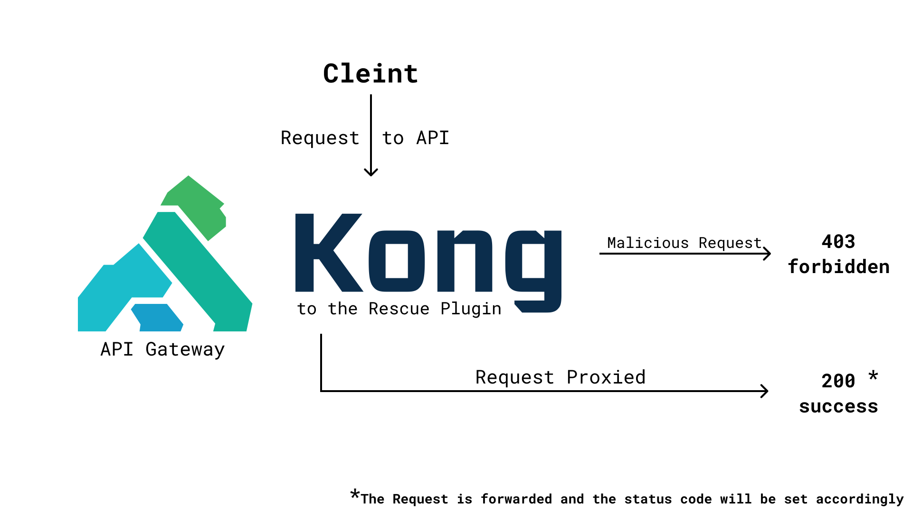

# KongToTheRescue

A Kong API Gateway Plugin that forbids the requests that are potentially harmful to the system

As of now, we test for:

- SQL Injection
- XSS (Cross Site Scripting)
- Directory Traversal

## KongToTheRescue Architecture

Currently, the plugin is only used for testing purposes. And has been created while I was exploring Kong.

This repo has 2 branches:

1. master:
   Has the custom plugin code
2. block-ip-plugin:
   Has a simple Lua web server that has been proxied via Kong to block certain IP addresses.

## How to use

1. Install [Kong-Pongo CLI](https://github.com/Kong/kong-pongo)
2. Clone the repo using `git clone https://github.com/ShubhamPalriwala/KongToTheRescue.git`
3. Get into the project directory `cd KongToTheRescue`
4. Start a pongo shell, run `pongo shell` (if pongo isn't added to the path, then use `~/.local/bin/pongo shell`)
5. Once you are in the pongo shell, run the `./config.sh` script present in the root directory of this repo.
6. Now test the plugin by running `curl -I -H "Host: mychapter.com" http://localhost:8000/`

## File Structure

Inside kong/plugins/kongtotherescue, you’ll see two files:

- `handler.lua`: This is where the main functionality of your plugin resides. Each phase of the request/response lifecycle has a function, which the plugin implements to provide custom behavior. Basically the logic of the plugin

In handler.lua, one can have several methods that take the form of function plugin:<name>. These methods run during the execution lifecycle of Kong. The complete list of their descriptions in the API reference documentation.

- `schema.lua`: If the plugin requires additional configuration, such as key/value pairs a user can provide to alter behavior, the logic for that is stored here.

PS: I will be wokring on this to make it production ready soon and will release a release.

I hope this plugin will make me more Credible soon enough :)
