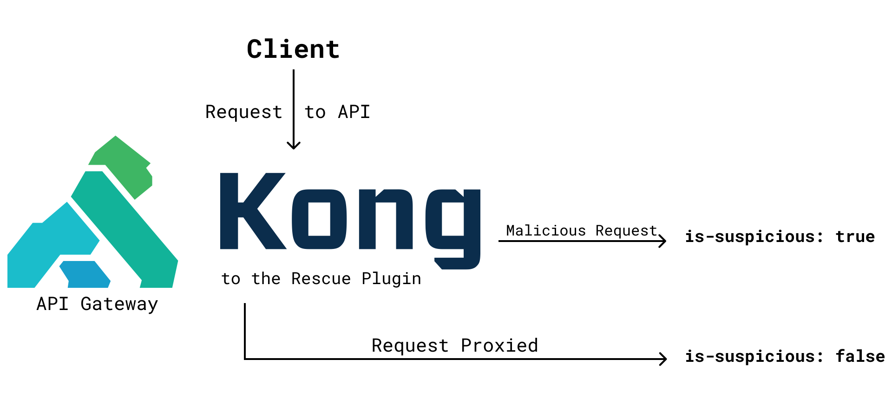
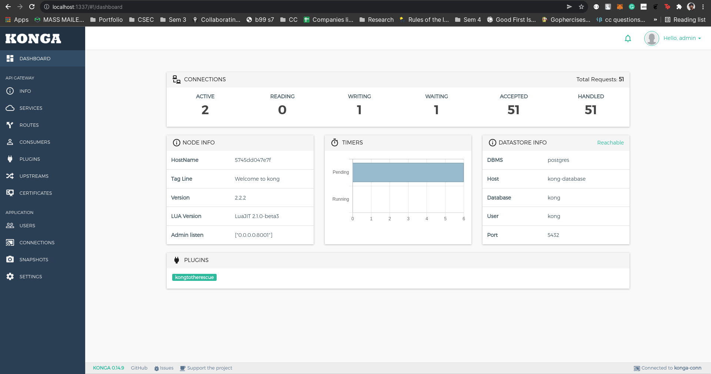

# KongToTheRescue

A Kong API Gateway Plugin that adds an `is-suspicious` header to the response for any potentially harmful requests to the system

As of now, we test for:

- SQL Injection
- XSS (Cross Site Scripting)
- Directory Traversal

Currently we add it to the response header only to verify the legitimacy but later we can add it to the request header itself so that one can discard such requests before even processing them on the server.

## KongToTheRescue Architecture



Currently, the plugin is only used for testing purposes. And has been created while I was exploring Kong.

This repo has 2 branches:

1. master:
   Has the custom plugin code
2. block-ip-plugin:
   Has a simple Lua web server that has been proxied via Kong to block certain IP addresses.

## How to use:

1. Clone the repo using `git clone https://github.com/ShubhamPalriwala/KongToTheRescue.git`
2. Get into the project directory `cd KongToTheRescue`

3. Run the following command in your terminal:

```sh
docker-compose up
```

Now feel free to test out the plugin by accessing [http://localhost:8000/](http://localhost:8000/) and look for the header `is-suspicious` in the response. Happy messing around.

## Accessing Kong Admin API using Konga GUI

1. Visit `localhost:1337`
2. Register with your details (don't worry they are stored in your docker Postgres DB itself and does not go out)
3. Now login with those credentials
4. To connect to the Kong Admin API, we need to find the IP of our kong instance, for that, run:

```sh
$ sudo docker network inspect kong-net | grep Gateway
"Gateway": "172.20.0.1"
```

5. Now enter a uniue connection name and this IP appended with port 8001 on the Konga GUI as `http://<your-gateway-ip>:8001`

6. That's it! Now explore around the Konga GUI where you can also see out **KongTotheRescue** live!
   

## File Structure

Inside kong/plugins/kongtotherescue, you’ll see two files:

- `handler.lua`: This is where the main functionality of your plugin resides. Each phase of the request/response lifecycle has a function, which the plugin implements to provide custom behavior. Basically the logic of the plugin.
  - plugin:initworker(): This is the first function called when the plugin is loaded and is used to initialize the plugin.
  - plugin:access(): This is the next function that is called when the plugin is loaded and is used to fetch data for our plugin from the request.
  - plugin:header_filter(): This is the next and the last function (for now) that is called when the plugin is loaded and is used to modify the headers of the request as per our requirements.

In handler.lua, one can have several methods that take the form of function plugin:<name>. These methods run during the execution lifecycle of Kong. The complete list of their descriptions in the API reference documentation.

- `schema.lua`: If the plugin requires additional configuration, such as key/value pairs a user can provide to alter behavior, the logic for that is stored here.

PS: I will be working on this to make it production ready soon and will release a release.

<p align="center">I hope this plugin will make me more Credible soon enough :)</p>
